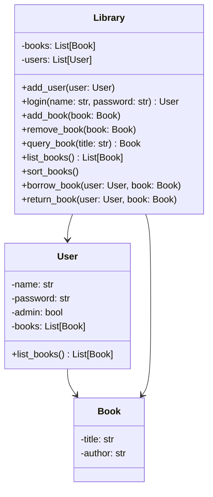

# Python Book Manager

Simple book manager written in python.

```mermaid
classDiagram
class Book {
  -title: str
  -author: str
}

class User {
  -name: str
  -password: str
  -admin: bool
  -books: List[Book]
  +list_books() List[Book]
}

class Library {
  -books: List[Book]
  -users: List[User]
  +add_user(user: User)
  +login(name: str, password: str) User
  +add_book(book: Book)
  +remove_book(book: Book)
  +query_book(title: str) Book
  +list_books() List[Book]
  +sort_books()
  +borrow_book(user: User, book: Book)
  +return_book(user: User, book: Book)
}

User --> Book
Library --> User
Library --> Book
```